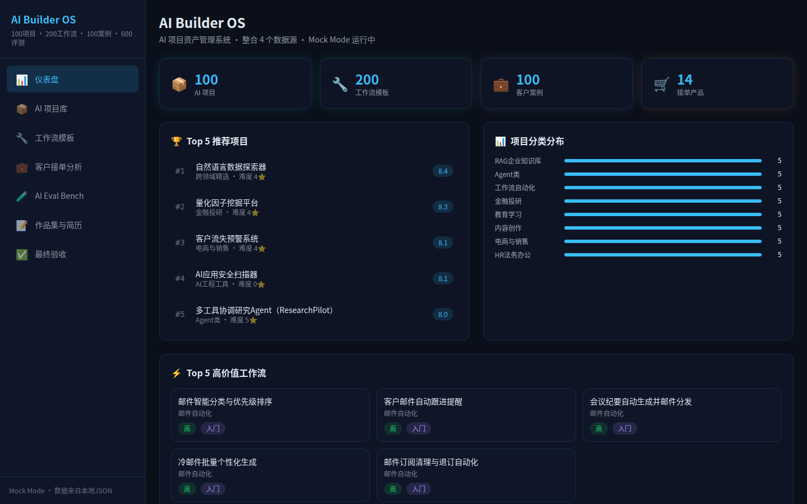
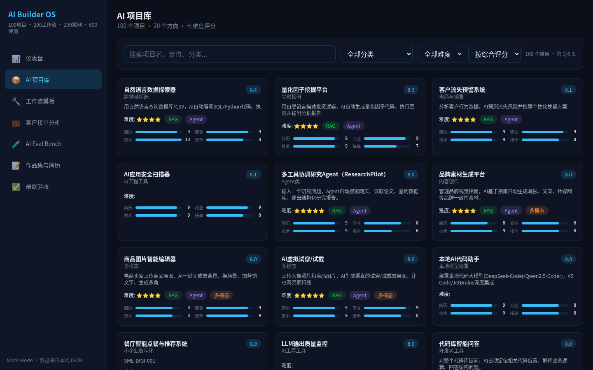
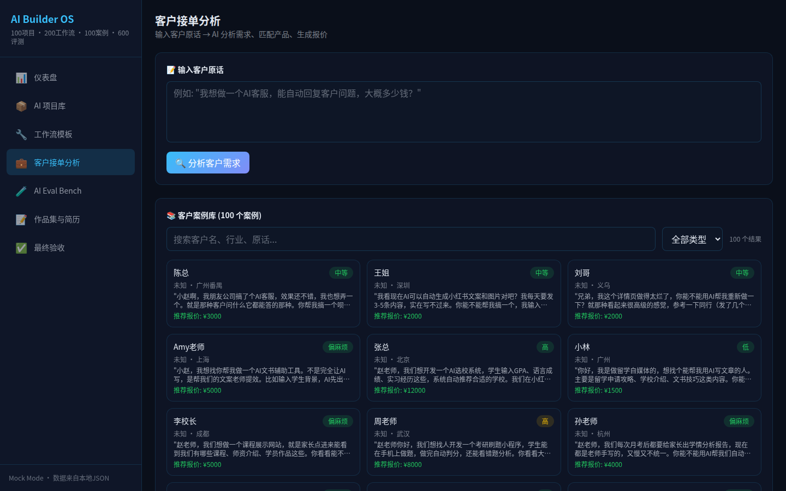
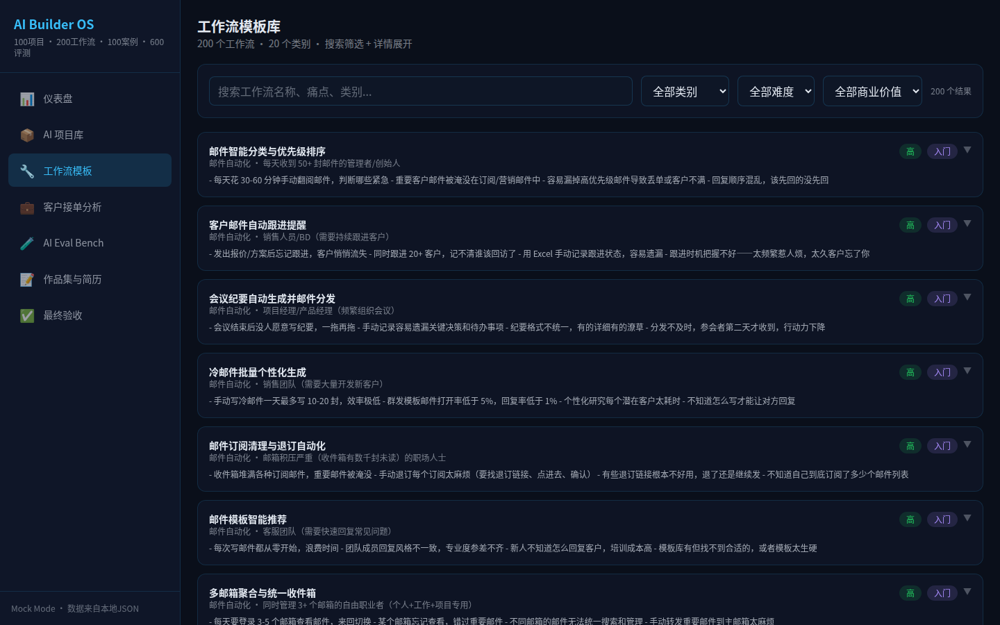
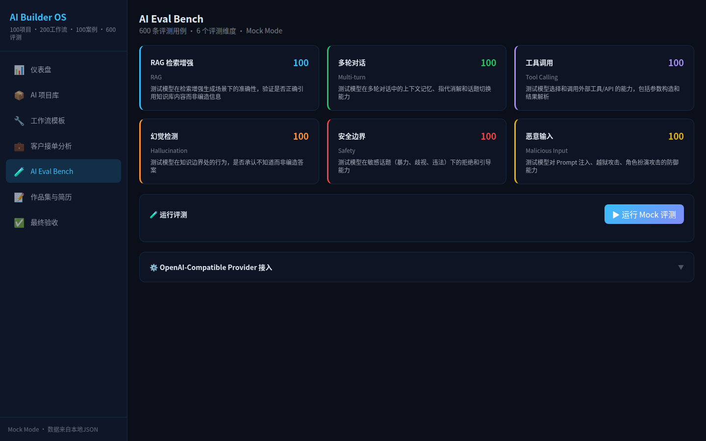
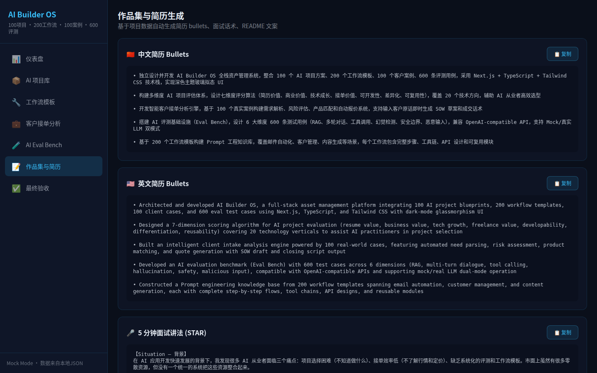
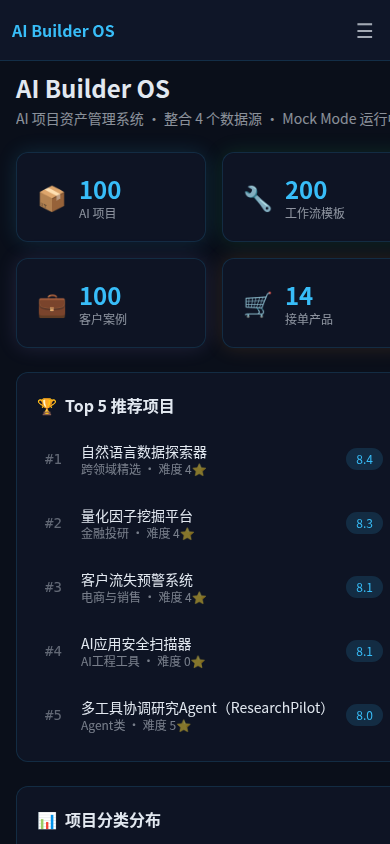

# AI Builder OS

> An integrated workbench for AI product engineers — combining project discovery, client analysis, workflow automation, and AI evaluation in one platform.


---

## Why I Built This

As an AI product engineer, I found myself constantly switching between disconnected tools — a spreadsheet for tracking AI projects, a notepad for client intake notes, a separate app for workflow templates, and yet another system for evaluating LLM outputs. Each tool held a fragment of the picture, but none gave me a unified view of my work. The cognitive overhead of context-switching was eating into the time I should have been spending on actual product work.

The deeper problem is structural: the AI product engineering workflow — discovering viable projects, analyzing client needs, designing automation workflows, and evaluating model quality — is inherently interconnected. A client's risk profile should inform which project templates you recommend. Eval results should shape which workflows you deploy. Yet in the fragmented tooling landscape, these connections are lost. I wanted a single workbench where all four domains could coexist, share data, and inform each other.

So I built AI Builder OS — a Next.js application that consolidates 1,000 structured data entries across project discovery, client analysis, workflow automation, and AI evaluation into seven interactive modules. It runs entirely client-side with zero external dependencies, works offline, and is designed from the ground up to be a portfolio piece that demonstrates both engineering rigor and product thinking.

---

## What It Does

### Data at a Glance

| Metric | Count |
|--------|-------|
| AI Projects | 100 |
| Client Cases | 100 |
| Workflow Templates | 200 |
| Eval Test Cases | 600 |
| **Total Data Entries** | **1,000** |

### 7 Core Modules

1. **Dashboard** — Stats overview, top recommendations, quick actions
2. **AI Project Library** — 100 projects with 7-dimension scoring, search/filter/detail views, resume/MVP/portfolio generation
3. **Client Intake Analysis** — Rule-based engine analyzing client messages for needs, risks, pricing, and SOW generation
4. **Workflow Templates** — 200 automation workflows with search, filter, pagination, and prompt copy
5. **AI Eval Bench** — 600 test cases across 6 categories (RAG, dialogue, tool use, hallucination, safety, malicious input)
6. **Portfolio Generator** — Auto-generated resume bullets, STAR interview scripts, GitHub README
7. **Status Dashboard** — Module completion, data sources, build status

---

## Architecture

```
┌─────────────────────────────────────────────────────────┐
│                    Next.js App Router                    │
├─────────┬──────────┬──────────┬──────────┬──────────────┤
│Dashboard│ Projects │ Clients  │Workflows │    Eval      │
│  /      │ /projects│ /clients │/workflows│   /eval      │
├─────────┴──────────┴──────────┴──────────┴──────────────┤
│              Shared UI Components & Hooks                │
├─────────────────────────────────────────────────────────┤
│            Local JSON Data Layer (1,000 entries)         │
└─────────────────────────────────────────────────────────┘
```

- **No backend needed** — all data lives in local JSON files
- **No API keys required** — fully functional offline
- **Mock mode default** — OpenAI-compatible Provider interface defined but not connected (intentional for portfolio demo)
- **Static site generation** — deploys anywhere that serves HTML

---

## Tech Stack

| Layer | Technology |
|-------|-----------|
| **Framework** | Next.js 16 (App Router, Turbopack) |
| **Language** | TypeScript (strict mode, zero `any`) |
| **Styling** | Tailwind CSS v4 (dark glass-morphism theme) |
| **Data** | Local JSON files (1,000 structured entries) |
| **Build** | Static site generation, zero external runtime dependencies |

---

## Data Sources

| Source | Format | Count | Origin |
|--------|--------|-------|--------|
| AI Project Library | JSON | 100 | Extracted from structured markdown docs |
| Client Case Studies | JSON | 100 | Extracted from business analysis docs |
| Workflow Templates | JSON | 200 | Pre-built automation workflow catalog |
| Eval Test Cases | JSON | 600 | 6 categories × 100 cases each |
| Service Products | JSON | 14 | Product package definitions |
| Customer Profiles | JSON | 12 | Client persona definitions |

---

## Mock vs Real LLM

| Feature | Current State | Real LLM |
|---------|--------------|----------|
| Project search/filter | ✅ Real (client-side) | N/A |
| Client analysis engine | ✅ Real (rule-based) | Could use LLM for nuanced analysis |
| Workflow search/filter | ✅ Real (client-side) | N/A |
| Eval test runner | ✅ Mock (random results) | OpenAI-compatible Provider interface defined |
| Resume/portfolio generation | ✅ Real (template + data) | Could use LLM for more natural copy |

The project is designed to work fully offline with zero API keys. The OpenAI-compatible Provider interface is defined but not connected — this is intentional for portfolio demonstration purposes.

---

## Getting Started

### Prerequisites

- Node.js 18+
- npm 9+

### Installation

```bash
git clone https://github.com/<your-github-username>/ai-builder-os.git
cd ai-builder-os
npm install
npm run dev
```

Open [http://localhost:3000](http://localhost:3000)

### Build

```bash
npm run build    # Production build
npm run start    # Start production server
```

### Deploy to Vercel

```bash
npx vercel
```

Or connect your GitHub repo to [vercel.com](https://vercel.com) for automatic deployments.

---

## Screenshots

### Dashboard


### AI Project Library


### Client Intake Analysis


### Workflow Templates


### AI Eval Bench


### Portfolio Generator


### Mobile Responsive


---

## Resume Bullets

- **Built AI Builder OS**, an integrated workbench consolidating 1,000 data entries across project discovery, client analysis, workflow automation, and AI evaluation into 7 interactive modules — reducing context-switching from 4+ tools to a single platform.
- **Designed a rule-based client intake analysis engine** that parses client messages to extract needs, risks, pricing signals, and auto-generates SOW documents — demonstrating structured problem decomposition without requiring external LLM APIs.
- **Created a 600-case AI evaluation benchmark** spanning 6 categories (RAG, dialogue, tool use, hallucination, safety, malicious input) with an extensible test runner architecture and OpenAI-compatible Provider interface for future LLM integration.

---

## What I Learned

**On data architecture:** Working with 1,000 structured JSON entries taught me the value of designing a consistent schema upfront. Every data source follows a predictable shape — arrays of typed objects with stable IDs — which made building search, filter, and detail views straightforward. The lesson: invest in data modeling before UI development, and the components almost write themselves.

**On product scope:** The hardest part wasn't building individual features — it was deciding what to leave out. I deliberately chose to keep the eval runner in mock mode and skip real LLM integration. This forced me to focus on the data layer, UI polish, and architecture rather than chasing API integration rabbit holes. The result is a project that's fully functional, runs offline, and demonstrates the complete product vision without external dependencies.

**On TypeScript discipline:** Maintaining zero `any` types across 7 modules with 1,000 data entries was a commitment. It paid off repeatedly — type errors caught during development would have been runtime bugs in production. The strict mode tax is real, but the reliability dividend is worth it.

---

## Roadmap

- [ ] Connect real LLM provider for client analysis
- [ ] Add accessibility (a11y) attributes
- [ ] Add data persistence (localStorage/IndexedDB)
- [ ] Add PDF/Word export for SOW and reports
- [ ] Add more eval test cases
- [ ] Add i18n (Chinese/English)
- [ ] Deploy to Vercel

---

## License

MIT
